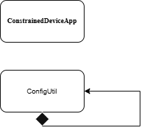

# Constrained Device Application (Connected Devices)

## Lab Module 01

Be sure to implement all the PIOT-CDA-* issues (requirements) listed at [PIOT-INF-01-001 - Lab Module 01](https://github.com/orgs/programming-the-iot/projects/1#column-9974937).

### Description

NOTE: Include two full paragraphs describing your implementation approach by answering the questions listed below.

What does your implementation do? 
This program starts and stops the Constrained Device App and writes log messages.

How does your implementation work?
It works by creating a ConstrainedDeviceApp in main(), calling startApp(), waiting 65 seconds, and then calling stopApp(). During runtime, it loads the configuration.

### Code Repository and Branch

NOTE: Be sure to include the branch (e.g. https://github.com/programming-the-iot/python-components/tree/alpha001).

URL: https://github.com/Mooyeonkim628/TELE6530_Lab_CDA/tree/labmodule01

### UML Design Diagram(s)

NOTE: Include one or more UML designs representing your solution. It's expected each
diagram you provide will look similar to, but not the same as, its counterpart in the
book [Programming the IoT](https://learning.oreilly.com/library/view/programming-the-internet/9781492081401/).

### Unit Tests Executed

NOTE: TA's will execute your unit tests. You only need to list each test case below
(e.g. ConfigUtilTest, DataUtilTest, etc). Be sure to include all previous tests, too,
since you need to ensure you haven't introduced regressions.

- python -m unittest tests/unit/common/test_ConfigUtilDefault.py
- python -m unittest tests/unit/common/test_ConfigUtilCustom.py

### Integration Tests Executed

NOTE: TA's will execute most of your integration tests using their own environment, with
some exceptions (such as your cloud connectivity tests). In such cases, they'll review
your code to ensure it's correct. As for the tests you execute, you only need to list each
test case below (e.g. SensorSimAdapterManagerTest, DeviceDataManagerTest, etc.)

- python -m unittest tests/integration/app/test_ConstrainedDeviceApp.py

EOF.
