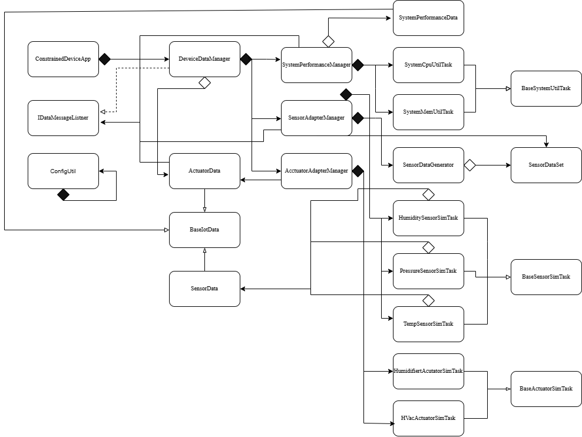

# Constrained Device Application (Connected Devices)

## Lab Module 03

Be sure to implement all the PIOT-CDA-* issues (requirements) listed at [PIOT-INF-03-001 - Lab Module 03](https://github.com/orgs/programming-the-iot/projects/1#column-10488379).

### Description

NOTE: Include two full paragraphs describing your implementation approach by answering the questions listed below.

What does your implementation do? 
- This implementation simulates sensor data for temperature, pressure, and humidity. It generates telemetry values with predefined ranges and datasets, packages them into SensorData objects, and sends them through the CDA to demonstrate sensing and data flow without physical hardware.

How does your implementation work?
- The CDA initializes simulation tasks using the SensorDataGenerator to create datasets for each sensor. On each cycle, the next value from the dataset is retrieved and converted into a SensorData object. Also, the scheduler triggers this process, allowing the system to produce and handle simulated telemetry data.

### Code Repository and Branch

NOTE: Be sure to include the branch (e.g. https://github.com/programming-the-iot/python-components/tree/alpha001).

URL: https://github.com/Mooyeonkim628/TELE6530_Lab_CDA/tree/labmodule03

### UML Design Diagram(s)

NOTE: Include one or more UML designs representing your solution. It's expected each
diagram you provide will look similar to, but not the same as, its counterpart in the
book [Programming the IoT](https://learning.oreilly.com/library/view/programming-the-internet/9781492081401/).

### Unit Tests Executed

NOTE: TA's will execute your unit tests. You only need to list each test case below
(e.g. ConfigUtilTest, DataUtilTest, etc). Be sure to include all previous tests, too,
since you need to ensure you haven't introduced regressions.

- python -m unittest tests/unit/common/test_ConfigUtilDefault.py
- python -m unittest tests/unit/common/test_ConfigUtilCustom.py
- python -m unittest tests/unit/system/test_SystemCpuUtilTask.py
- python -m unittest tests/unit/system/test_SystemMemUtilTask.py

- python -m unittest tests/unit/data/test_ActuatorData.py
- python -m unittest tests/unit/data/test_SensorData.py
- python -m unittest tests/unit/data/test_SystemPerformanceData.py
- python -m unittest tests/unit/sim/test_HumiditySensorSimTask.py
- python -m unittest tests/unit/sim/test_PressureSensorSimTask.py
- python -m unittest tests/unit/sim/test_TemperatureSensorSimTask.py
- python -m unittest tests/unit/sim/test_HumidifierActuatorSimTask.py
- python -m unittest tests/unit/sim/test_HvacActuatorSimTask.py

### Integration Tests Executed

NOTE: TA's will execute most of your integration tests using their own environment, with
some exceptions (such as your cloud connectivity tests). In such cases, they'll review
your code to ensure it's correct. As for the tests you execute, you only need to list each
test case below (e.g. SensorSimAdapterManagerTest, DeviceDataManagerTest, etc.)

- python -m unittest tests/integration/app/test_DeviceDataManagerNoComms.py
- python -m unittest tests/integration/app/test_ConstrainedDeviceApp.py

EOF.
