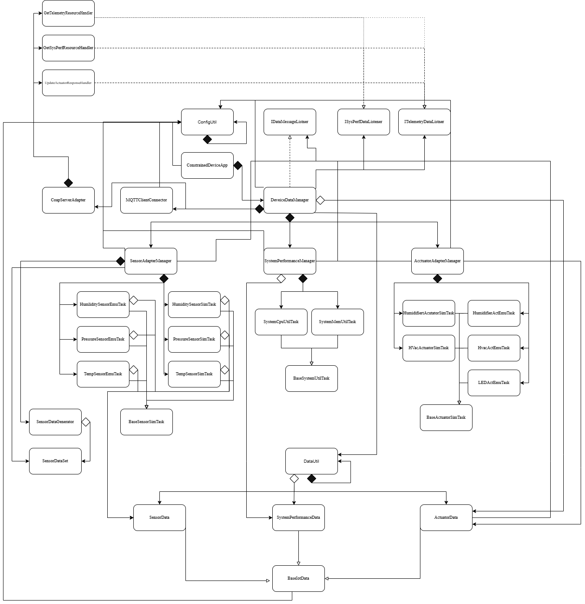

# Constrained Device Application (Connected Devices)

## Lab Module 08

Be sure to implement all the PIOT-CDA-* issues (requirements) listed at [PIOT-INF-08-001 - Lab Module 08](https://github.com/orgs/programming-the-iot/projects/1#column-10488501).

### Description

NOTE: Include two full paragraphs describing your implementation approach by answering the questions listed below.

What does your implementation do? 
- This implementation creates and runs a CoAP server that handles resources for actuator commands, sensor data, and system performance data. It helps resource discovery, responds to direct GET requests for resources, and indicates which is observable.

How does your implementation work?
- The implementation uses CoapServerAdapter to initialize a CoAP server, create the resource handlers, and register them under the CDA resource PIOT/ConstrainedDevice/ActuatorCmd/HumidifierActuator. Get handlers maintain the latest sensor and system performance data and return them as JSON in response to GET requests, while UpdateActuatorResourceHandler provides actuator resources and process their requests. These handlers are connected to DeviceDataManager through listener callbacks, let the device manager can pass updated data into the CoAP resources.

### Code Repository and Branch

NOTE: Be sure to include the branch (e.g. https://github.com/programming-the-iot/python-components/tree/alpha001).

URL: https://github.com/Mooyeonkim628/TELE6530_Lab_CDA/tree/labmodule08

### UML Design Diagram(s)

NOTE: Include one or more UML designs representing your solution. It's expected each
diagram you provide will look similar to, but not the same as, its counterpart in the
book [Programming the IoT](https://learning.oreilly.com/library/view/programming-the-internet/9781492081401/).

### Unit Tests Executed

NOTE: TA's will execute your unit tests. You only need to list each test case below
(e.g. ConfigUtilTest, DataUtilTest, etc). Be sure to include all previous tests, too,
since you need to ensure you haven't introduced regressions.

- (old)
- python -m unittest tests/unit/common/test_ConfigUtilDefault.py
- python -m unittest tests/unit/common/test_ConfigUtilCustom.py
- python -m unittest tests/unit/system/test_SystemCpuUtilTask.py
- python -m unittest tests/unit/system/test_SystemMemUtilTask.py
- python -m unittest tests/unit/data/test_ActuatorData.py
- python -m unittest tests/unit/data/test_SensorData.py
- python -m unittest tests/unit/data/test_SystemPerformanceData.py
- python -m unittest tests/unit/sim/test_HumiditySensorSimTask.py
- python -m unittest tests/unit/sim/test_PressureSensorSimTask.py
- python -m unittest tests/unit/sim/test_TemperatureSensorSimTask.py
- python -m unittest tests/unit/sim/test_HumidifierActuatorSimTask.py
- python -m unittest tests/unit/sim/test_HvacActuatorSimTask.py

### Integration Tests Executed

NOTE: TA's will execute most of your integration tests using their own environment, with
some exceptions (such as your cloud connectivity tests). In such cases, they'll review
your code to ensure it's correct. As for the tests you execute, you only need to list each
test case below (e.g. SensorSimAdapterManagerTest, DeviceDataManagerTest, etc.)

- python -m unittest tests/integration/connection/test_CoapServerAdapter.py 

EOF.
