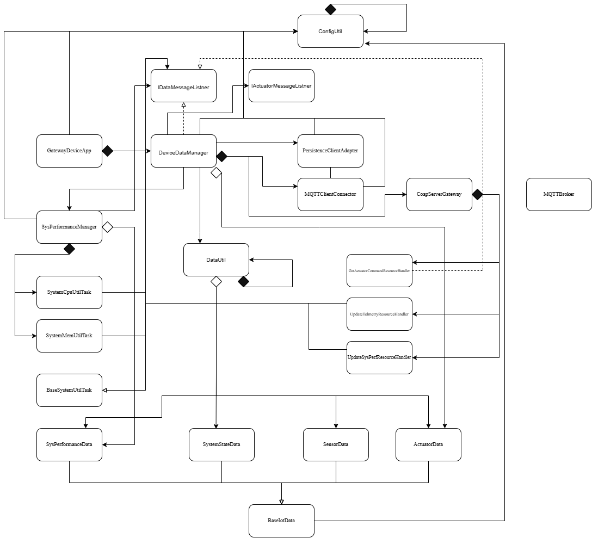

# Gateway Device Application (Connected Devices)

## Lab Module 08

Be sure to implement all the PIOT-GDA-* issues (requirements) listed at [PIOT-INF-08-001 - Lab Module 08](https://github.com/orgs/programming-the-iot/projects/1#column-10488501).

### Description

NOTE: Include two full paragraphs describing your implementation approach by answering the questions listed below.

What does your implementation do? 
- This implementation creates and runs a CoAP server that exposes the main device resources for actuator commands, sensor data, and system performance data. It routes incoming CoAP requests to the correct handlers, accepts updates from the CDA through PUT requests, and provides an actuator command resource.

How does your implementation work?
- The implementation uses CoapServerGateway to initialize a Californium CoAP server, create the default resource handlers, and register them into a resource such as PIOT/ConstrainedDevice/SystemPerfMsg. Update resource handlers process incoming PUT requests by parsing JSON payloads into data objects and forwarding them to DeviceDataManager through IDataMessageListener callbacks, while GetActuatorCommandResourceHandler stores actuator data locally and responds to GET requests.

### Code Repository and Branch

NOTE: Be sure to include the branch (e.g. https://github.com/programming-the-iot/python-components/tree/alpha001).

URL: https://github.com/Mooyeonkim628/TELE6530_Lab_GDA/tree/labmodule08

### UML Design Diagram(s)

NOTE: Include one or more UML designs representing your solution. It's expected each
diagram you provide will look similar to, but not the same as, its counterpart in the
book [Programming the IoT](https://learning.oreilly.com/library/view/programming-the-internet/9781492081401/).

### Unit Tests Executed

NOTE: TA's will execute your unit tests. You only need to list each test case below
(e.g. ConfigUtilTest, DataUtilTest, etc). Be sure to include all previous tests, too,
since you need to ensure you haven't introduced regressions.

- (old)
- mvn test -Dtest=ConfigUtilDefaultTest
- mvn test -Dtest=ConfigUtilCustomTest
- mvn test -Dtest=SystemCpuUtilTaskTest
- mvn test -Dtest=SystemMemUtilTaskTest
- mvn test -Dtest=ActuatorDataTest
- mvn test -Dtest=SensorDataTest
- mvn test -Dtest=SystemPerformanceDataTest
- mvn test -Dtest=DataUtilTest

### Integration Tests Executed

NOTE: TA's will execute most of your integration tests using their own environment, with
some exceptions (such as your cloud connectivity tests). In such cases, they'll review
your code to ensure it's correct. As for the tests you execute, you only need to list each
test case below (e.g. SensorSimAdapterManagerTest, DeviceDataManagerTest, etc.)

- mvn test -Dtest=CoapClientToServerConnectorTest
- mvn test -Dtest=CoapServerGatewayTest

EOF.
