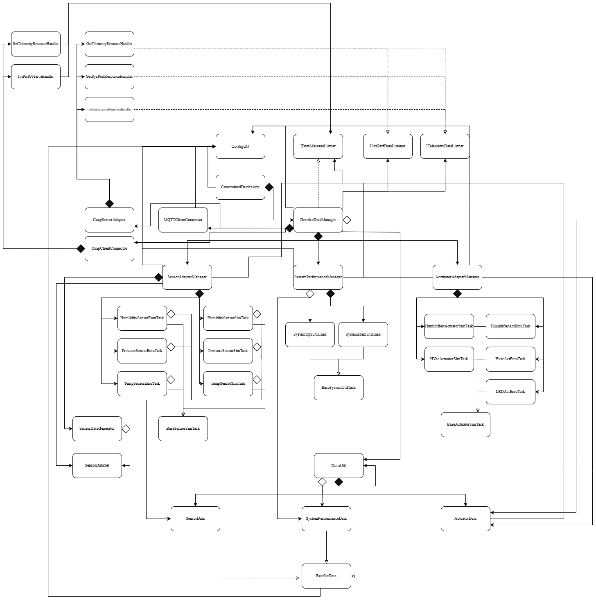

# Constrained Device Application (Connected Devices)

## Lab Module 09

Be sure to implement all the PIOT-CDA-* issues (requirements) listed at [PIOT-INF-09-001 - Lab Module 09](https://github.com/orgs/programming-the-iot/projects/1#column-10488503).

### Description

NOTE: Include two full paragraphs describing your implementation approach by answering the questions listed below.

What does your implementation do? 
- This implementation adds CoAP client, let the device can send and receive application data through CoAP requests. It can handle GET, PUT, POST, DELETE, discovery, and observe function, and it also exposes local CDA resources such as sensor data, system performance data, and actuator commands through the CoAP server.

How does your implementation work?
- The CoapClientConnector reads the server host and port from the configuration file, creates a CoAP client connection, builds resource URIs from ResourceNameEnum, and sends requests in either CON or NON mode. For observe, it starts a subscription to a remote resource and uses observer handlers to receive updates.

### Code Repository and Branch

NOTE: Be sure to include the branch (e.g. https://github.com/programming-the-iot/python-components/tree/alpha001).

URL: https://github.com/Mooyeonkim628/TELE6530_Lab_CDA/tree/labmodule09

### UML Design Diagram(s)

NOTE: Include one or more UML designs representing your solution. It's expected each
diagram you provide will look similar to, but not the same as, its counterpart in the
book [Programming the IoT](https://learning.oreilly.com/library/view/programming-the-internet/9781492081401/).

### Unit Tests Executed

NOTE: TA's will execute your unit tests. You only need to list each test case below
(e.g. ConfigUtilTest, DataUtilTest, etc). Be sure to include all previous tests, too,
since you need to ensure you haven't introduced regressions.

- (old)
- python -m unittest tests/unit/common/test_ConfigUtilDefault.py
- python -m unittest tests/unit/common/test_ConfigUtilCustom.py
- python -m unittest tests/unit/system/test_SystemCpuUtilTask.py
- python -m unittest tests/unit/system/test_SystemMemUtilTask.py
- python -m unittest tests/unit/data/test_ActuatorData.py
- python -m unittest tests/unit/data/test_SensorData.py
- python -m unittest tests/unit/data/test_SystemPerformanceData.py
- python -m unittest tests/unit/sim/test_HumiditySensorSimTask.py
- python -m unittest tests/unit/sim/test_PressureSensorSimTask.py
- python -m unittest tests/unit/sim/test_TemperatureSensorSimTask.py
- python -m unittest tests/unit/sim/test_HumidifierActuatorSimTask.py
- python -m unittest tests/unit/sim/test_HvacActuatorSimTask.py

### Integration Tests Executed

NOTE: TA's will execute most of your integration tests using their own environment, with
some exceptions (such as your cloud connectivity tests). In such cases, they'll review
your code to ensure it's correct. As for the tests you execute, you only need to list each
test case below (e.g. SensorSimAdapterManagerTest, DeviceDataManagerTest, etc.)

- python -m unittest tests/integration/connection/test_CoapClientConnector.py

EOF.
