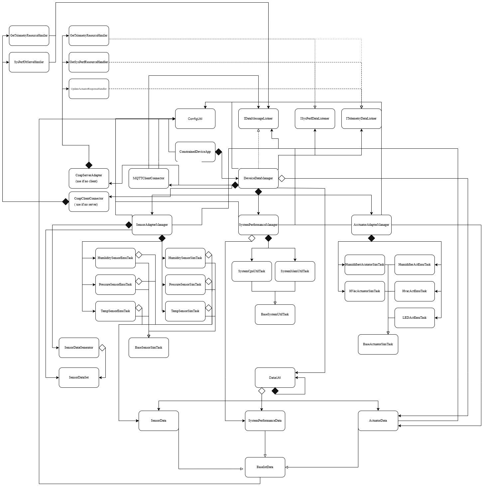

# Constrained Device Application (Connected Devices)

## Lab Module 10

Be sure to implement all the PIOT-CDA-* issues (requirements) listed at [PIOT-INF-10-001 - Lab Module 10](https://github.com/orgs/programming-the-iot/projects/1#column-10488510).

### Description

NOTE: Include two full paragraphs describing your implementation approach by answering the questions listed below.

What does your implementation do? 

This implmentation enables edge messaging between the CDA and GDA using MQTT. The CDA reads sensor data from the device side and reacts immediately to local threshold violations, while the GDA receives sensor messages from the CDA, tracks longer-term trends, and triggers preemptive actuation when needed. CDA app would monitors sensor readings and publishes sensor messages upstream. It also processses incoming actuator commands and change the actuator's state.

How does your implementation work?

The CDA periodically reads sensor values and packages them into data objects. These sensor readings are then published to MQTT topics. The CDA also subscribes to actuator command messages. When an actuator command arrives from the GDA, the CDA parses the incoming JSON message into an ActuatorData object and passes it to the actuator command handler. That handler applies the requested action on the device side. Since the local CDA temperature actuation is enabled, the CDA can response when temperature met the threshold value. 

### Code Repository and Branch

NOTE: Be sure to include the branch (e.g. https://github.com/programming-the-iot/python-components/tree/alpha001).

URL:  https://github.com/Mooyeonkim628/TELE6530_Lab_CDA/tree/labmodule10

### UML Design Diagram(s)

NOTE: Include one or more UML designs representing your solution. It's expected each
diagram you provide will look similar to, but not the same as, its counterpart in the
book [Programming the IoT](https://learning.oreilly.com/library/view/programming-the-internet/9781492081401/).

### Unit Tests Executed

NOTE: TA's will execute your unit tests. You only need to list each test case below
(e.g. ConfigUtilTest, DataUtilTest, etc). Be sure to include all previous tests, too,
since you need to ensure you haven't introduced regressions.

- (old)
- python -m unittest tests/unit/common/test_ConfigUtilDefault.py
- python -m unittest tests/unit/common/test_ConfigUtilCustom.py
- python -m unittest tests/unit/system/test_SystemCpuUtilTask.py
- python -m unittest tests/unit/system/test_SystemMemUtilTask.py
- python -m unittest tests/unit/data/test_ActuatorData.py
- python -m unittest tests/unit/data/test_SensorData.py
- python -m unittest tests/unit/data/test_SystemPerformanceData.py
- python -m unittest tests/unit/sim/test_HumiditySensorSimTask.py
- python -m unittest tests/unit/sim/test_PressureSensorSimTask.py
- python -m unittest tests/unit/sim/test_TemperatureSensorSimTask.py
- python -m unittest tests/unit/sim/test_HumidifierActuatorSimTask.py
- python -m unittest tests/unit/sim/test_HvacActuatorSimTask.py

### Integration Tests Executed

NOTE: TA's will execute most of your integration tests using their own environment, with
some exceptions (such as your cloud connectivity tests). In such cases, they'll review
your code to ensure it's correct. As for the tests you execute, you only need to list each
test case below (e.g. SensorSimAdapterManagerTest, DeviceDataManagerTest, etc.)

- python -m unittest tests/integration/connection/test_MQTTClientPerformance.py
- python -m unittest tests/integration/connection/test_CoapClientPerformance.py
- python -m unittest tests/integration/connection/test_MqttClientConnector.py
- python -m unittest tests/integration/app/test_DeviceDataManagerWithComms.py
- python -m unittest tests/integration/app/test_DeviceDataManagerIntegration.py

###MQTT Performance test result

testConnectAndDisconnect (tests.integration.connection.test_MqttClientPerformance.MqttClientConnectorTest.testConnectAndDisconnect) ... 2026-03-20 11:19:44,583:ConfigUtil:INFO:Loading default config: ./config/PiotConfig.props
2026-03-20 11:19:44,584:ConfigUtil:INFO:Path found. Attempting config file load: ./config/PiotConfig.props
2026-03-20 11:19:44,585:ConfigUtil:INFO:Config file successfully loaded from path: ./config/PiotConfig.props
2026-03-20 11:19:44,585:ConfigUtil:DEBUG:Config: ['Mqtt.GatewayService', 'Coap.GatewayService', 'Data.GatewayService', 'ConstrainedDevice']
2026-03-20 11:19:44,585:ConfigUtil:INFO:Created instance of ConfigUtil: <programmingtheiot.common.ConfigUtil.ConfigUtil object at 0x7bc93a11b740>
2026-03-20 11:19:44,585:MqttClientConnector:INFO:       MQTT Client ID:   CDAMqttClientPerformanceTest001
2026-03-20 11:19:44,585:MqttClientConnector:INFO:       MQTT Broker Host: localhost
2026-03-20 11:19:44,585:MqttClientConnector:INFO:       MQTT Broker Port: 1883
2026-03-20 11:19:44,585:MqttClientConnector:INFO:       MQTT Keep Alive:  60
2026-03-20 11:19:44,590:MqttClientConnector:INFO:MQTT client connecting to broker at host: localhost, port: 8883, tls: True
2026-03-20 11:19:44,636:MqttClientConnector:INFO:MQTT client connected to broker: <paho.mqtt.client.Client object at 0x7bc93a094770>
2026-03-20 11:19:44,696:MqttClientConnector:INFO:Disconnecting MQTT client from broker: localhost
2026-03-20 11:19:45,637:MqttClientConnector:INFO:MQTT client disconnected from broker: <paho.mqtt.client.Client object at 0x7bc93a094770>
2026-03-20 11:19:45,638:test_MqttClientPerformance:INFO:Connect and Disconnect: 1052.45621 ms
ok
testPublishQoS0 (tests.integration.connection.test_MqttClientPerformance.MqttClientConnectorTest.testPublishQoS0) ... 2026-03-20 11:19:45,638:MqttClientConnector:INFO:   MQTT Client ID:   CDAMqttClientPerformanceTest001
2026-03-20 11:19:45,639:MqttClientConnector:INFO:       MQTT Broker Host: localhost
2026-03-20 11:19:45,639:MqttClientConnector:INFO:       MQTT Broker Port: 1883
2026-03-20 11:19:45,639:MqttClientConnector:INFO:       MQTT Keep Alive:  60
2026-03-20 11:19:45,640:MqttClientConnector:INFO:MQTT client connecting to broker at host: localhost, port: 8883, tls: True
2026-03-20 11:19:45,688:MqttClientConnector:INFO:MQTT client connected to broker: <paho.mqtt.client.Client object at 0x7bc93a0c7bc0>
2026-03-20 11:19:45,747:DataUtil:INFO:Created DataUtil instance.
2026-03-20 11:19:46,575:MqttClientConnector:INFO:Disconnecting MQTT client from broker: localhost
2026-03-20 11:19:47,577:MqttClientConnector:INFO:MQTT client disconnected from broker: <paho.mqtt.client.Client object at 0x7bc93a0c7bc0>
2026-03-20 11:19:47,577:test_MqttClientPerformance:INFO:Publish message - QoS 0 [10000]: 827.776704 ms
ok
testPublishQoS1 (tests.integration.connection.test_MqttClientPerformance.MqttClientConnectorTest.testPublishQoS1) ... 2026-03-20 11:19:47,578:MqttClientConnector:INFO:   MQTT Client ID:   CDAMqttClientPerformanceTest001
2026-03-20 11:19:47,578:MqttClientConnector:INFO:       MQTT Broker Host: localhost
2026-03-20 11:19:47,578:MqttClientConnector:INFO:       MQTT Broker Port: 1883
2026-03-20 11:19:47,578:MqttClientConnector:INFO:       MQTT Keep Alive:  60
2026-03-20 11:19:47,579:MqttClientConnector:INFO:MQTT client connecting to broker at host: localhost, port: 8883, tls: True
2026-03-20 11:19:47,627:MqttClientConnector:INFO:MQTT client connected to broker: <paho.mqtt.client.Client object at 0x7bc93addde20>
2026-03-20 11:19:47,685:DataUtil:INFO:Created DataUtil instance.
2026-03-20 11:19:49,616:MqttClientConnector:INFO:Disconnecting MQTT client from broker: localhost
2026-03-20 11:19:50,618:MqttClientConnector:INFO:MQTT client disconnected from broker: <paho.mqtt.client.Client object at 0x7bc93addde20>
2026-03-20 11:19:50,619:test_MqttClientPerformance:INFO:Publish message - QoS 1 [10000]: 1931.247029 ms
ok
testPublishQoS2 (tests.integration.connection.test_MqttClientPerformance.MqttClientConnectorTest.testPublishQoS2) ... 2026-03-20 11:19:50,619:MqttClientConnector:INFO:   MQTT Client ID:   CDAMqttClientPerformanceTest001
2026-03-20 11:19:50,619:MqttClientConnector:INFO:       MQTT Broker Host: localhost
2026-03-20 11:19:50,619:MqttClientConnector:INFO:       MQTT Broker Port: 1883
2026-03-20 11:19:50,620:MqttClientConnector:INFO:       MQTT Keep Alive:  60
2026-03-20 11:19:50,621:MqttClientConnector:INFO:MQTT client connecting to broker at host: localhost, port: 8883, tls: True
2026-03-20 11:19:50,672:MqttClientConnector:INFO:MQTT client connected to broker: <paho.mqtt.client.Client object at 0x7bc93a1e4b90>
2026-03-20 11:19:50,732:DataUtil:INFO:Created DataUtil instance.
2026-03-20 11:19:58,861:MqttClientConnector:INFO:Disconnecting MQTT client from broker: localhost
2026-03-20 11:19:59,863:MqttClientConnector:INFO:MQTT client disconnected from broker: <paho.mqtt.client.Client object at 0x7bc93a1e4b90>
2026-03-20 11:19:59,863:test_MqttClientPerformance:INFO:Publish message - QoS 2 [10000]: 8129.38735 ms
ok

----------------------------------------------------------------------
Ran 4 tests in 15.280s

OK

- qos 0: 827.776704 ms
- qos 1: 1931.247029 ms
- qos 2: 8129.38735 ms

- Fastest: qos 0
- Slowest: qos 2

###Coap Performance test result

testPostRequestCon (tests.integration.connection.test_CoapClientPerformance.CoapClientPerformanceTest.testPostRequestCon)
Comment the annotation to perf test CON POST ... ok

----------------------------------------------------------------------
Ran 1 test in 139.362s

OK
PROJECT_ROOT_PATH is set, using /home/mooki/piot/cda-python-components as cwd for execution payload
Testing POST - CON

POST message - useCON = True [10000]: 136458.263459 ms. Payload Len: 259
disconnectClient() skipped due to thread exhaustion: cannot join thread before it is started

testPostRequestNon (tests.integration.connection.test_CoapClientPerformance.CoapClientPerformanceTest.testPostRequestNon)
Comment the annotation to perf test NON POST ... ok

----------------------------------------------------------------------
Ran 1 test in 126.124s

OK
PROJECT_ROOT_PATH is set, using /home/mooki/piot/cda-python-components as cwd for execution payload
Testing POST - NON

POST message - useCON = False [10000]: 124080.672932 ms. Payload Len: 259

- Percentage difference (NON baseline): 9.98%
- Fastest: NON (124080 ms)
- Slowest: CON (136458 ms)

EOF.
