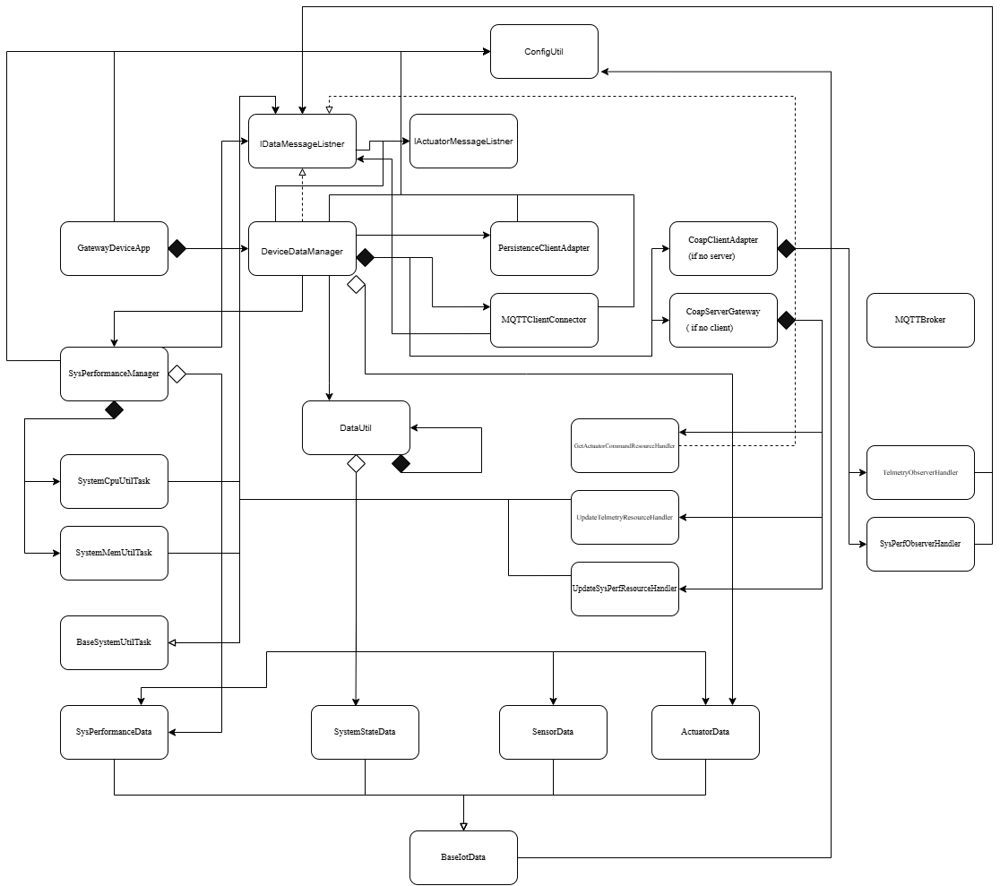

# Gateway Device Application (Connected Devices)

## Lab Module 10

Be sure to implement all the PIOT-GDA-* issues (requirements) listed at [PIOT-INF-10-001 - Lab Module 10](https://github.com/orgs/programming-the-iot/projects/1#column-10488510).

### Description

NOTE: Include two full paragraphs describing your implementation approach by answering the questions listed below.

What does your implementation do? 

This implmentation enables edge messaging between the CDA and GDA using MQTT. The CDA reads sensor data from the device side and reacts immediately to local threshold violations, while the GDA receives sensor messages from the CDA, tracks longer-term trends, and triggers preemptive actuation when needed. GDA apps would subscribes to sensor messages sent by the CDA, analyzes the incoming values and sends actuator commands back to the CDA when the threshold condition met. 

How does your implementation work?

After the MQTT connection, the GDA subscribes to the CDA sensor, actuator response, and system performance topics. When a message arrives, it parses the payload and forwards the data to the appropriate handler.For sensor messages, the GDA processes incoming SensorData and performs analysis. The GDA checks whether humidity is out of bound of threshold. When the value exceeds such range, the GDA creates an ActuatorData command and publishes it back to the CDA.

### Code Repository and Branch

NOTE: Be sure to include the branch (e.g. https://github.com/programming-the-iot/python-components/tree/alpha001).

URL: https://github.com/Mooyeonkim628/TELE6530_Lab_GDA/tree/labmodule10

### UML Design Diagram(s)

NOTE: Include one or more UML designs representing your solution. It's expected each
diagram you provide will look similar to, but not the same as, its counterpart in the
book [Programming the IoT](https://learning.oreilly.com/library/view/programming-the-internet/9781492081401/).

### Unit Tests Executed

NOTE: TA's will execute your unit tests. You only need to list each test case below
(e.g. ConfigUtilTest, DataUtilTest, etc). Be sure to include all previous tests, too,
since you need to ensure you haven't introduced regressions.

- (old)
- mvn test -Dtest=ConfigUtilDefaultTest
- mvn test -Dtest=ConfigUtilCustomTest
- mvn test -Dtest=SystemCpuUtilTaskTest
- mvn test -Dtest=SystemMemUtilTaskTest
- mvn test -Dtest=ActuatorDataTest
- mvn test -Dtest=SensorDataTest
- mvn test -Dtest=SystemPerformanceDataTest
- mvn test -Dtest=DataUtilTest

### Integration Tests Executed

NOTE: TA's will execute most of your integration tests using their own environment, with
some exceptions (such as your cloud connectivity tests). In such cases, they'll review
your code to ensure it's correct. As for the tests you execute, you only need to list each
test case below (e.g. SensorSimAdapterManagerTest, DeviceDataManagerTest, etc.)

- mvn test -Dtest=MqttClientPerformanceTest
- mvn test -Dtest=CoapClientPerformanceTest
- mvn test -Dtest=MqttClientConnectorTest

### Performance Test Result

INFO: \n\tTesting Publish: QoS = 0 | msgs = 10000 | payload size = 212 | start = 1.7740201E9 | end = 1.7740201E9 | elapsed = 2.2973
Mar 20, 2026 11:21:03 AM programmingtheiot.integration.connection.MqttClientPerformanceTest execTestPublish
INFO: \n\tTesting Publish: QoS = 1 | msgs = 10000 | payload size = 212 | start = 1.77403226E9 | end = 1.77403226E9  | elapsed = 3.3471
Mar 20, 2026 11:21:03 AM programmingtheiot.gda.connection.MqttClientConnector connectClient
INFO: MQTT client connecting to broker: ssl://localhost:8883
Mar 20, 2026 11:21:03 AM programmingtheiot.gda.connection.MqttClientConnector connectComplete
INFO: MQTT connection successful (is reconnect = false). Broker: ssl://localhost:8883
Mar 20, 2026 11:21:10 AM programmingtheiot.gda.connection.MqttClientConnector disconnectClient
INFO: Disconnecting MQTT client from broker: ssl://localhost:8883
Mar 20, 2026 11:21:10 AM programmingtheiot.integration.connection.MqttClientPerformanceTest execTestPublish
INFO: \n\tTesting Publish: QoS = 2 | msgs = 10000 | payload size = 212 | start = 1.7740201E9 | end = 1.7740201E9 | elapsed = 6.6371
Mar 20, 2026 11:21:10 AM programmingtheiot.gda.connection.MqttClientConnector connectClient
INFO: MQTT client connecting to broker: ssl://localhost:8883
Mar 20, 2026 11:21:10 AM programmingtheiot.gda.connection.MqttClientConnector disconnectClient
INFO: Disconnecting MQTT client from broker: ssl://localhost:8883
Mar 20, 2026 11:21:10 AM programmingtheiot.gda.connection.MqttClientConnector connectComplete
INFO: MQTT connection successful (is reconnect = false). Broker: ssl://localhost:8883
Mar 20, 2026 11:21:10 AM programmingtheiot.integration.connection.MqttClientPerformanceTest testConnectAndDisconnect
INFO: Connect and Disconnect [1]: 229 ms
Tests run: 4, Failures: 0, Errors: 0, Skipped: 0, Time elapsed: 13.16 s - in programmingtheiot.integration.connection.MqttClientPerformanceTest

Results:

Tests run: 4, Failures: 0, Errors: 0, Skipped: 0

------------------------------------------------------------------------
BUILD SUCCESS
------------------------------------------------------------------------
Total time:  14.389 s
Finished at: 2026-03-20T11:21:10-04:00

- qos 0: 2297.3 ms
- qos 1: 3347.1 ms
- qos 2: 6637.1 ms

- Fastest: qos 0
- Slowest: qos 2

EOF.
