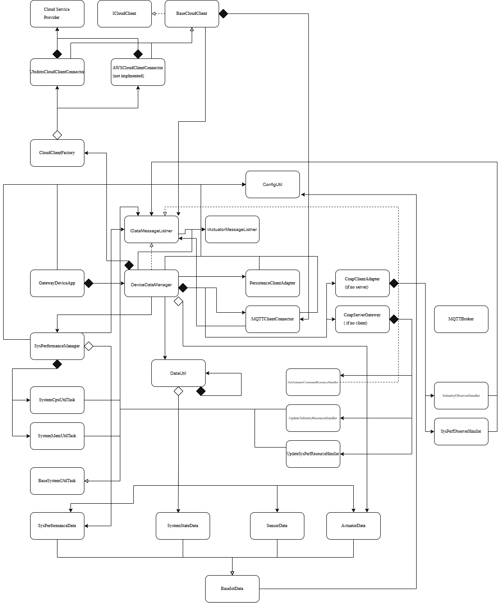

# Gateway Device Application (Connected Devices)

## Lab Module 11

Be sure to implement all the PIOT-GDA-* issues (requirements) listed at [PIOT-INF-11-001 - Lab Module 11](https://github.com/orgs/programming-the-iot/projects/1#column-10488514).

### Description

NOTE: Include two full paragraphs describing your implementation approach by answering the questions listed below.

What does your implementation do? 

This implementation connects the GDA to cloud IoT platforms (this case, Ubidots). It enables the GDA to publish edge device telemetry up to the cloud and receive commands back down to the CDA, completing the full pipeline.

How does your implementation work?

The CloudClientConnector implements the ICloudClient interface and delegates all MQTT transport to an internally managed MqttClientConnector. When telemetry arrives from the CDA, DeviceDataManager routes it through CloudClientConnector to the appropriate cloud MQTT topic. Incoming cloud messages are passed back through the IDataMessageListener callback that forwards them down to the edge devices.

### Code Repository and Branch

NOTE: Be sure to include the branch (e.g. https://github.com/programming-the-iot/python-components/tree/alpha001).

URL: https://github.com/Mooyeonkim628/TELE6530_Lab_GDA/tree/labmodule11

### UML Design Diagram(s)

NOTE: Include one or more UML designs representing your solution. It's expected each
diagram you provide will look similar to, but not the same as, its counterpart in the
book [Programming the IoT](https://learning.oreilly.com/library/view/programming-the-internet/9781492081401/).

### Unit Tests Executed

NOTE: TA's will execute your unit tests. You only need to list each test case below
(e.g. ConfigUtilTest, DataUtilTest, etc). Be sure to include all previous tests, too,
since you need to ensure you haven't introduced regressions.

- (old)
- mvn test -Dtest=ConfigUtilDefaultTest
- mvn test -Dtest=ConfigUtilCustomTest
- mvn test -Dtest=SystemCpuUtilTaskTest
- mvn test -Dtest=SystemMemUtilTaskTest
- mvn test -Dtest=ActuatorDataTest
- mvn test -Dtest=SensorDataTest
- mvn test -Dtest=SystemPerformanceDataTest
- mvn test -Dtest=DataUtilTest

### Integration Tests Executed

NOTE: TA's will execute most of your integration tests using their own environment, with
some exceptions (such as your cloud connectivity tests). In such cases, they'll review
your code to ensure it's correct. As for the tests you execute, you only need to list each
test case below (e.g. SensorSimAdapterManagerTest, DeviceDataManagerTest, etc.)

- mvn test -Dtest=MqttClientConnectorTest
- mvn test -Dtest=TimeAndValuePayloadDataTest
- mvn test -Dtest=CloudClientConnectorTest
- mvn test -Dtest=CloudClientFactoryTest

EOF.
