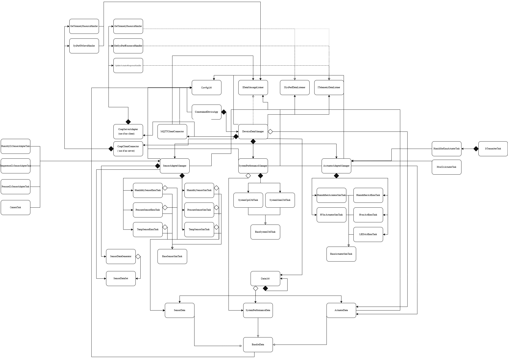

# Constrained Device Application (Connected Devices)

## Lab Module 12 - Semester Project - CDA Components

Be sure to implement all the PIOT-CDA-* issues (requirements) listed at [PIOT-INF-12-001 - Lab Module 12](https://github.com/orgs/programming-the-iot/projects/1#column-10488565).

### Description

NOTE: Include two full paragraphs describing your implementation approach by answering the questions listed below.

What does your implementation do? 

The CDA collects real-time environmental data (temperature, humidity, pressure) from a Sense HAT and streams live video via Camera Module 3 over RTSP. It controls an HVAC unit via IR LED and a humidifier via a TP-Link Kasa smart plug, with actuator behavior automatically determined by season mode (summer/winter) configured in the config file. Motion detection triggers email alerts through Ubidots and saves local MP4 recordings.

How does your implementation work?

Sensor data is published to the GDA via MQTT over TLS, secured through Tailscale VPN. The HVAC is controlled by replaying IR transmitter-reciever module on GPIO 12. The humidifier is controlled by toggling a Kasa EP10 smart plug via the python-kasa cloud API. Motion detection uses numpy frame differencing on frames captured from picamera2, and when triggered, publishes a motion event to Ubidots which fires an email alert, while simultaneously recording a 1-minute MP4 locally on the RPi.

### Code Repository and Branch

NOTE: Be sure to include the branch (e.g. https://github.com/programming-the-iot/python-components/tree/alpha001).

URL: https://github.com/Mooyeonkim628/TELE6530_Lab_CDA/tree/labmodule12

### UML Design Diagram(s)

NOTE: Include one or more UML designs representing your solution. It's expected each
diagram you provide will look similar to, but not the same as, its counterpart in the
book [Programming the IoT](https://learning.oreilly.com/library/view/programming-the-internet/9781492081401/).

### Unit Tests Executed

NOTE: TA's will execute your unit tests. You only need to list each test case below
(e.g. ConfigUtilTest, DataUtilTest, etc). Be sure to include all previous tests, too,
since you need to ensure you haven't introduced regressions.

- (old)
- python -m unittest tests/unit/common/test_ConfigUtilDefault.py
- python -m unittest tests/unit/common/test_ConfigUtilCustom.py
- python -m unittest tests/unit/system/test_SystemCpuUtilTask.py
- python -m unittest tests/unit/system/test_SystemMemUtilTask.py
- python -m unittest tests/unit/data/test_ActuatorData.py
- python -m unittest tests/unit/data/test_SensorData.py
- python -m unittest tests/unit/data/test_SystemPerformanceData.py
- python -m unittest tests/unit/sim/test_HumiditySensorSimTask.py
- python -m unittest tests/unit/sim/test_PressureSensorSimTask.py
- python -m unittest tests/unit/sim/test_TemperatureSensorSimTask.py
- python -m unittest tests/unit/sim/test_HumidifierActuatorSimTask.py
- python -m unittest tests/unit/sim/test_HvacActuatorSimTask.py

### Integration Tests Executed

NOTE: TA's will execute most of your integration tests using their own environment, with
some exceptions (such as your cloud connectivity tests). In such cases, they'll review
your code to ensure it's correct. As for the tests you execute, you only need to list each
test case below (e.g. SensorSimAdapterManagerTest, DeviceDataManagerTest, etc.)

- python -m unittest tests/integration/embedded/test_CameraTask.py
- python -m unittest tests/integration/embedded/test_EmbeddedActuatorAdapter.py
- python -m unittest tests/integration/embedded/test_EmbeddedSensorAdapter.py
  

EOF.
