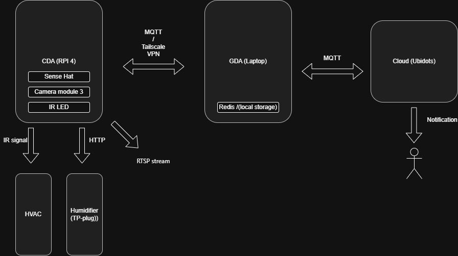
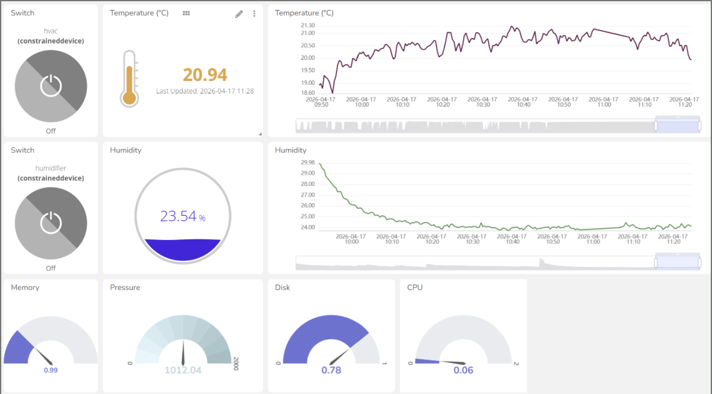
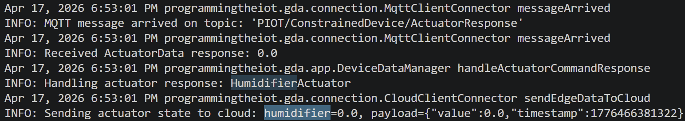
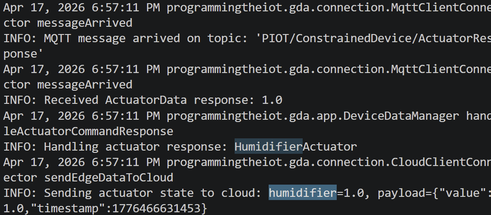

# Lab Module 12 - Semester Project - Final Write-up

NOTE: Be sure to implement all the Lab Module 12 requirements listed at [Lab Module 12](https://github.com/orgs/programming-the-iot/projects/1#column-10488565).

## Description

Describe your idea in 1 paragraph (at least 2 or 3 sentences).

This project implements a smart home environment control system using a Raspberry Pi 4 as CDA, a laptop running a GDA, and Ubidots as the cloud platform. The system communicates via MQTT over TLS for secure sensor data transmission and actuator control, and continuously monitors indoor temperature, humidity, and pressure via Sense HAT. It controls an HVAC air conditioner via an transmitter module on GPIO 12, and a humidifier via a TP-Link Kasa EP10 smart plug. The system also provides real-time streaming with automatic motion detection, MP4 recording, and email alerting, while Redis on the GDA persists system performance data locally.

## What - The Problem 

What problem did you tackle and why does it matter? Write 1 to 2 paragraphs in response.

When leaving home for long periods, high summer temperatures and humidity can cause mold damage to belongings and electronics, while freezing temperatures in winter can burst pipes. This system monitors and controls the indoor environment remotely to prevent such damage, and also provides weekly or monthly indoor temperature and humidity history through the Ubidots cloud dashboard.
For those living in dormitories or shared housing where room security is limited, expensive commercial home cameras are often not a viable option. This system offers a cost-effective alternative using affordable off-the-shelf hardware such as a Raspberry Pi and Camera Module to achieve similar functionality.

## Why - Who Cares? 

Why do you care about this particular problem? Write 1 to 2 paragraphs in response.

This project is relevant to students living in dormitories or shared housing who cannot afford expensive commercial security cameras but still need basic room monitoring and motion alerting. It is also useful for people who travel frequently or leave their homes for extended periods in regions with extreme seasonal temperatures, where hot summers risk mold and electronics damage and cold winters risk frozen pipes.
More broadly, anyone who wants accessible, real-time visibility into their home environment without being physically present can benefit from this system, which is built entirely from affordable and easily available hardware.

## How - Expected Technical Approach

Write 1 to 2 paragraphs describing the outcomes you achieved.

The CDA reads temperature, humidity, and pressure from a Sense HAT, with season mode (summer/winter) set in the config file to determine different actuator thresholds. HVAC control is approached by first recording the AC unit's IR signal using a IR receiver, then replaying it via an IR transmitter driven by pigpio. The humidifier is controlled by toggling a TP-Link Kasa EP10 smart plug on and off via the python-kasa cloud API, rather than controlling the humidifier directly. Live video is streamed over RTSP via Camera Module 3, and when motion is detected through numpy frame differencing, it triggers a Ubidots event that sends an email alert and starts a 1-minute local MP4 recording, which can be retrieved via SCP over Tailscale.

The GDA bridges the CDA and Ubidots cloud via MQTT over TLS, using Tailscale VPN for secure long-range connectivity. Sensor data is forwarded to Ubidots, and actuators can be toggled manually via the Ubidots dashboard. To prevent race conditions between manual and automatic control, a 10-minute cloud override lock is applied whenever an actuator is triggered manually. System performance data including CPU, memory, and disk usage is persisted locally in Redis on the GDA.

### System Diagram

Embed a block diagram depicting your overall design, including the CDA, GDA, and Cloud Services interactions.
Be sure to include arrows depicting data flow from one application / service to the next.

Write 1 to 2 paragraphs describing your design.

The CDA hosts all physical hardware components — the Sense HAT for environmental sensing, Camera Module 3 for video streaming and motion detect, and an IR LED for HVAC control. The CDA communicates with the GDA via MQTT over TLS, secured through Tailscale VPN, allowing sensor data to flow upstream and actuator commands to flow downstream. The HVAC unit is controlled directly via IR signal from the CDA, while the humidifier is controlled via its TP-Link smart plug over HTTPS. Live video is streamed from the CDA directly to the user via RTSP, independent of the MQTT pipeline.

The GDA forwards sensor data upstream via MQTT and relaying cloud-initiated actuator commands back down to the CDA. It also maintains a local Redis instance for persisting system performance data. On the cloud side, Ubidots handles data visualization and sends email notifications to the user when motion is detected, closing the loop between the physical environment and the end user.

### What THREE (3) sensors and ONE (1) actuator did you use (add more if you wish)?

- CDA Sensor 1: SenseHAT Temperature

- CDA Sensor 2: SenseHAT Humidity 

- CDA Sensor 3: SenseHAT Pressure

- CDA Sensor 4: Camera Module 3 Motion Sensor

- CDA Actuator 1: HVAC - IR Transmitter

- CDA Actuator 2: Humidifier - Kasa EP10

### What ONE (1) CDA protocol and TWO (2) GDA protocols did you implement (add more if you wish)?

- CDA to GDA Protocol: MQTT over TLS

- GDA to CDA Protocol: MQTT over TLS

- GDA to Cloud Protocol: MQTT

- Cloud to GDA Protocol: MQTT

 
### What TWO (2) cloud services / capabilities did you use (add more if you wish)?

- Cloud Service 1 (data ingress - all inputs): Ubidots MQTT data ingestion 

- Cloud Service 2 (data egress - all actuation events): Ubidots Event Engine

## Screen Shots Representing Cloud Services

### Screen Shots Representing Visualized Data

NOTE: Include (at least) TWO (2) screen shots - one showing at least 1 hour
of time-series data from the CDA, and one showing an event being triggered
that results in an actuation event sent to your GDA and then to your CDA.

EOF.
